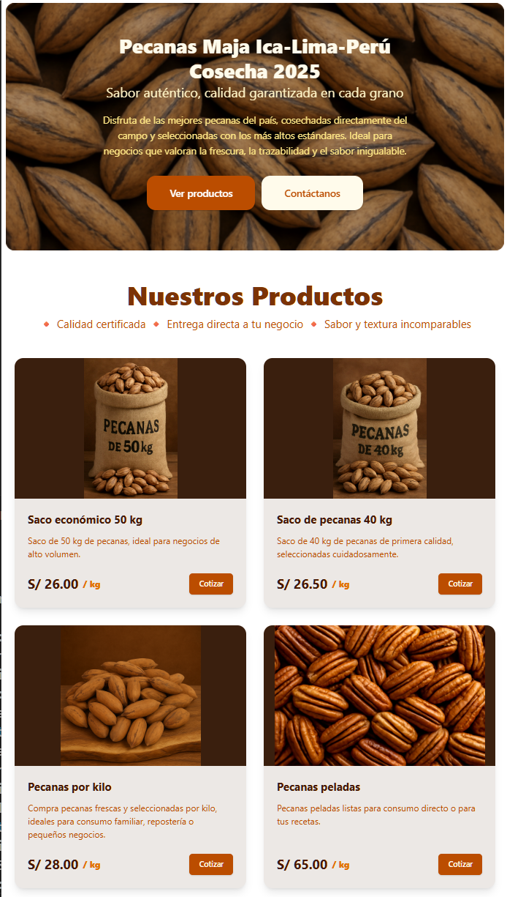

# 🥜 Pecanas Maja E-commerce

Aplicación web moderna de comercio electrónico especializada en la venta de pecanas. Construida con Astro y Tailwind CSS, este proyecto presenta características avanzadas como cotizaciones en tiempo real e integración perfecta con WhatsApp.



## ✨ Características Principales

- 🛍️ Catálogo de Productos Dinámico 
  - Gestión de productos en tiempo real
  - Vistas detalladas de productos
  - Imágenes de alta calidad
  
- 💬 Integración con WhatsApp Business
  - Solicitudes de cotización directas
  - Formateo automático de mensajes
  - Comunicación empresarial instantánea
  
- 🎨 Interfaz de Usuario Moderna
  - Diseño adaptable a todos los dispositivos
  - Soporte para tema claro/oscuro
  - Transiciones y animaciones suaves
  - Navegación intuitiva
  
- 🔧 Características Técnicas
  - Renderizado del lado del servidor para óptimo rendimiento
  - Estructura optimizada para SEO
  - Arquitectura de componentes modular
  - Desarrollo con seguridad de tipos

## 🛠️ Stack Tecnológico

### Frontend
- **[Astro](https://astro.build/)** - Generador de sitios estáticos moderno y rápido
- **[Tailwind CSS](https://tailwindcss.com/)** - Framework CSS utilitario
- **JavaScript/TypeScript** - Mejor experiencia de desarrollo y seguridad de tipos

### Herramientas de Desarrollo
- **Vite** - Herramientas de frontend de última generación
- **ESLint** - Calidad y consistencia del código
- **Git** - Control de versiones y colaboración

### Características de Rendimiento
- Generación de sitios estáticos
- Carga optimizada de recursos
- Manejo de imágenes responsivas
- Mínima huella de JavaScript

### Despliegue
- **[Vercel](https://vercel.com/)** - Plataforma de despliegue con:
  - Despliegue automático desde Git
  - Certificados SSL gratuitos
  - CDN global
  - Analytics integrado
  - Previews por cada PR

## 📁 Estructura del Proyecto

```text
/
├── public/              # Recursos estáticos
│   ├── images/         # Imágenes de productos y UI
│   └── favicon.ico     # Favicon del sitio
├── src/
│   ├── components/     # Componentes reutilizables
│   ├── layouts/        # Layouts de páginas
│   ├── pages/          # Componentes de ruta
│   ├── data/          # Datos y configuraciones
│   ├── styles/        # Estilos globales
│   └── config/        # Configuración del sitio
└── package.json        # Dependencias del proyecto
```

## 🚀 Comenzando

1. **Clonar el repositorio**
   ```bash
   git clone [url-repositorio]
   ```

2. **Instalar dependencias**
   ```bash
   npm install
   ```

3. **Iniciar servidor de desarrollo**
   ```bash
   npm run dev
   ```

4. **Construir para producción**
   ```bash
   npm run build
   ```

## 💻 Comandos de Desarrollo

| Comando                   | Acción                                           |
| :------------------------ | :----------------------------------------------- |
| `npm install`             | Instalar dependencias                            |
| `npm run dev`             | Iniciar servidor en `localhost:4321`             |
| `npm run build`           | Construir sitio para producción en `./dist/`     |
| `npm run preview`         | Previsualizar construcción localmente            |

## 🌟 Mejoras Futuras

- [x] Funcionalidad de carrito de compras
- [x] Autenticación de usuarios
- [x] Sistema de seguimiento de pedidos
- [x] Panel de administración
- [x] Integración de pasarela de pagos
- [x] Integración de analytics

## 📄 Licencia

Este proyecto está licenciado bajo la Licencia MIT - ver el archivo [LICENSE](LICENSE) para más detalles.

## 🤝 Contribuciones

¡Las contribuciones son bienvenidas! No dudes en enviar un Pull Request.
